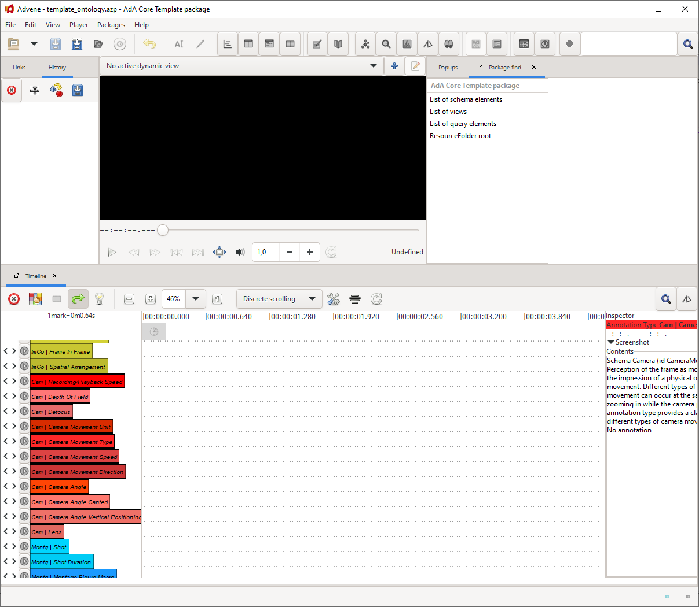

# Advene AdA Filmontology Template

This folder contains an Advene template package (**template_ontology.azp**) that allows you to annotate audiovisual content using the AdA Filmontology's predefined annotation types and values. It contains the imported ontology with its 8 annotation levels, 78 annotation types and 502 annotation values. 

## How to use the template

Normally, the ontology template is not used directly, instead a film-specific template is generated by the [AdA video analysis back end](https://github.com/ProjectAdA/ada-va) and offered for download once a new movie was ingested.

## Manual use of template

You can load the ontology template into Advene and start the annotation, but the following steps must be carried out in order to be able to export the annotations as Linked Data according to AdA Filmontology:

* Open template_ontology.azp in Advene
* Save as movie.azp
* File --> Associate a video file... (use the movie to annotate)
* Player --> Display media information (note down **duration** in ms)
* Player --> Verify video checksum --> Store in package
* View --> Package finder --> AdA Core Template package --> Metadata (note down media **checksum**)
* Edit --> Package Properties...
	* Fill in title, descripton
	* Fill in duration (ms) from media information
	* Fill in Media URI http://ada.cinepoetics.org/resource/media/{checksum} (checksum from Metadata)
	* Uncheck "Template Package"
* Save package
