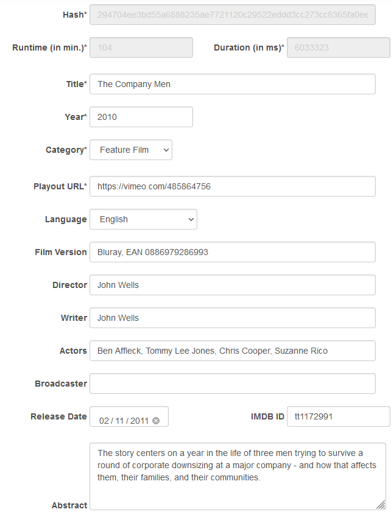
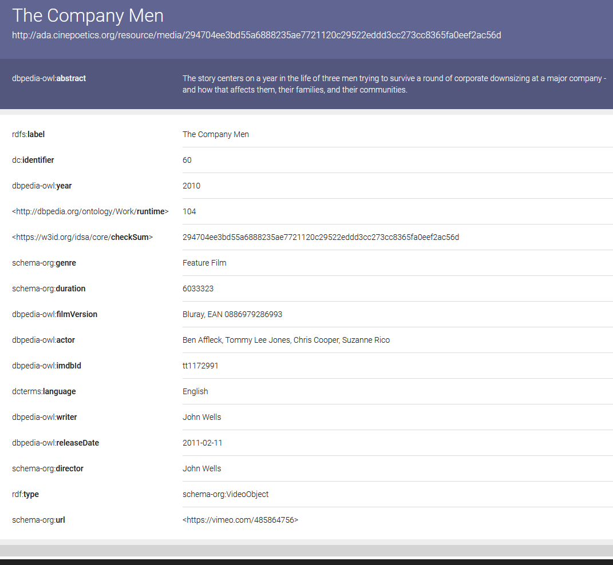

# Corpus Metadata

The project team of the FU Berlin compiled a video corpus with feature films, documentaries, television news and web videos on the global financial crisis after 2007 in order to examine audiovisual rhetorics of affect. This folder contains the semantic metadata of the corpus exported to different file formats. At the end of the project the corpus consisted of 391 films with approx. 176 hours. The following files are provided:

| File | Format |
| ----------- | ----------- |
| [corpus_metadata.ttl](corpus_metadata.ttl) | RDF dump in turtle format |
| [corpus_metadata.json](corpus_metadata.json) | JSON export |
| [corpus_metadata.html](corpus_metadata.html) | HTML export |

The JSON export also contains information on the scenes in a film and the number of annotations per annotation type.

An online version of the corpus overview is available [here](https://ada.cinepoetics.org/corpus/).

## Data fields

Metadata fields encode information using 17 existing vocabulary properties from DBpedia, schema.org and Dublin Core. Each entry is of type *schema-org:VideoObject* 

### Mandatory metadata fields

| Description | RDF property | JSON field name | 
| ----------- | ----------- | ----------- |
| Video Identifier (sha256 checksum) | https://w3id.org/idsa/core/checkSum | id |
| Short Identifier | http://purl.org/dc/elements/1.1/identifier | shortId |
| Title | http://www.w3.org/2000/01/rdf-schema#label | title |
| Runtime in minutes | http://dbpedia.org/ontology/Work/runtime | runtime |
| Video file duration in milliseconds | http://schema.org/duration | duration |
| Year of publication | http://dbpedia.org/ontology/year | year |
| Film category | http://schema.org/genre | category |
| URL to play the video | http://schema.org/url | playoutUrl |

In the JSON export the URI of each metadata entry is encoded in the field "mediauri". 

### Optional metadata fields

| Description | RDF property | JSON field name | 
| ----------- | ----------- | ----------- |
| Director | http://schema.org/director | director |
| Writer | http://dbpedia.org/ontology/writer | writer |
| Actors | http://dbpedia.org/ontology/actor | actors |
| Broadcaster | http://schema.org/broadcaster | broadcaster |
| Release Date | http://dbpedia.org/ontology/releaseDate | releaseDate |
| IMDB ID | http://dbpedia.org/ontology/imdbId | imdbId |
| Abstract | http://dbpedia.org/ontology/abstract | theabstract |
| Language | http://purl.org/dc/terms/language | language |
| Film Version | http://dbpedia.org/ontology/filmVersion | filmVersion |

## Examples

||
| ------ |
Fig. 1: Screenshot of the metadata editor in the video analysis back end.

||
| ------ |
Fig. 2: Screenshot of an metadata entry in LodView (from [http://ada.cinepoetics.org/resource/media/294704ee3bd55a6888235ae7721120c29522eddd3cc273cc8365fa0eef2ac56d](http://ada.cinepoetics.org/resource/media/294704ee3bd55a6888235ae7721120c29522eddd3cc273cc8365fa0eef2ac56d)
