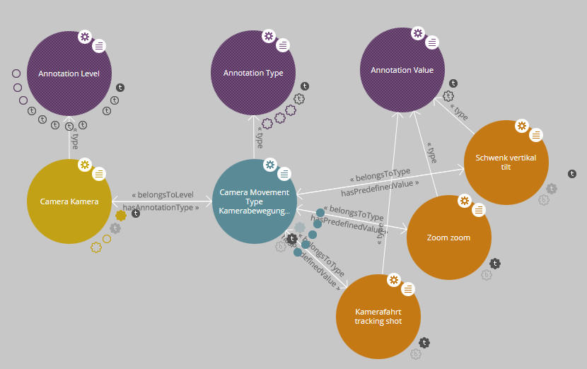
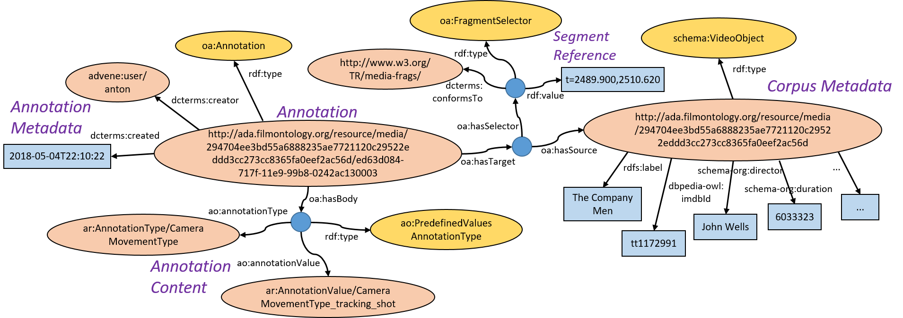

# AdA Filmontology

The AdA filmontology is a systematic vocabulary and data model of film-analytical terms and concepts for fine-grained semantic video annotations. Its goal is to provide a standardized and systematic way for the joint annotation of audiovisual corpora to enable comparable, systematic film analyzes. 

## General Structure

The film-analytical terms and concepts are defined on the basis of the Web Ontology Language (OWL) and the Resource Description Framework (RDF) in a class structure with associated properties (see Fig. 1). Annotation levels are categories that group similar concepts (e.g., "Camera"). Annotation types are the aspects of the annotation routine under which films are analyzed (e.g., "Camera Movement Speed" or "Camera Angle"). Annotation values are the specific characteristics that an annotation can have (e.g. "fast" or "slow" for camera movement speed). The final version (v1.9) of the AdA Filmontology contains 8 levels, 78 types and 502 predefined values (download [**ada_ontology.owl**](ada_ontology.owl)). A German and English name and description is stored for each concept.

||
| ------ |
Fig 1: The structure of levels, types, and values visualized using LodLive.

Annotation types are organized in different analysis sets, depending on how detailed a film is to be analyzed:
* AdaCorpusAnalysis: A set of annotation types that is always annotated during an analysis.
* AdaDetailedAnalysis: An extended set of annotation types used for detailed analysis.
* AdaFilmontologyComplete: All available annotation types of the ontology.

## Annotation Model

The AdA filmontology comprises an annotation model for semantic video annotations. Annotations are created on the basis of the [W3C Web Annotation Data Model](https://www.w3.org/TR/annotation-model/). They always consist of an annotation "target" (time fragment of a video) and the annotation "body" (the content of the annotation with information on annotation types / values, author and other metadata).  The video fragment is referenced using the [W3C Media Fragments URI](https://www.w3.org/TR/media-frags/) specification. There are four different types of annotations that can be used in the body:
* FreeTextAnnotationType: An annotation with textual content without any further structure.
* PredefinedValuesAnnotationType: An annotation that uses one or more predefined values ​​from AdA Filmontology.
* ContrastingAnnotationType: An annotation that juxtaposes one or more predefined values ​​from AdA Filmontology.
* EvolvingAnnotationType: An annotation that describes the transition from one predefined value to another predefined value.

||
| ------ |
Fig 2: Example annotation in the area of camera movement visualized as an RDF graph.

